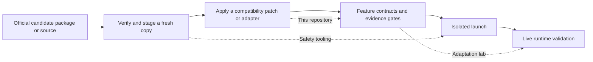

# codex-history-compat

While maintaining a ChatGPT/Codex desktop mod, I need both to follow official desktop updates and to keep different tasks on their established model services. A Responses-compatible service can reject history because of reasoning items, tool-call ordering, or image-resize notices. Fixing an ordinary request once does not prove that WebSocket or compacted history will still work.

This patch normalizes only the copy about to be sent and leaves durable local history alone. It is the compatibility part of the maintenance workflow: [electron-update-safety](https://github.com/catterhu1207-ux/electron-update-safety) handles safe isolation of a candidate package, while [desktop-adaptation-lab](https://github.com/catterhu1207-ux/desktop-adaptation-lab) explains the task workflow and acceptance states.

## What can I use it for?

- Add outbound-history compatibility handling to the pinned Codex source revision when using a Responses-compatible service.
- Handle encrypted reasoning items, orphaned tool calls or outputs, and image-resize notices placed between a call and its output without rewriting durable history.
- Apply the same rule to ordinary requests, WebSocket requests, local compaction, and both remote compaction paths.
- Reproduce the structure failure with synthetic fixtures only; no authentic request, session, image, or user path is included.

It is for people who build Codex from source and maintain a custom provider connection. It is not for ordinary users of the official desktop application.

To generate the desktop workflow mod from your own official Codex installation first, use [codex-desktop-workflow](https://github.com/catterhu1207-ux/codex-desktop-workflow). Its v0.1.0 still marks this backend patch as an unsupported desktop combination; the existence of the source patch does not mean that integration has qualified.

## Which of the four repositories do I need?

| Problem | Repository |
|---|---|
| Generate and run the mod from my own official Codex installation | [codex-desktop-workflow](https://github.com/catterhu1207-ux/codex-desktop-workflow) |
| A Codex history request is rejected by a compatible provider | **codex-history-compat** (this repository) |
| Is the update candidate trustworthy, and did isolated testing leave a process behind? | [electron-update-safety](https://github.com/catterhu1207-ux/electron-update-safety) |
| How do I require matching evidence before an adaptation moves forward? | [desktop-adaptation-lab](https://github.com/catterhu1207-ux/desktop-adaptation-lab) |



## What changes, and what does not?

| Target | Behavior |
|---|---|
| Request copy about to be sent to the model service | Removes incompatible reasoning items, moves messages out of interrupted tool-output regions, and repairs required tool-call pairing |
| Durable history and local session | Not rewritten |
| Ordinary, WebSocket, local-compaction, and remote-compaction requests | Uses the same compatibility pass |

The patch changes provider-incompatible shapes only for a target provider other than OpenAI. It does not promise that every third-party service will work or configure a service URL, account, or model for you.

## Quick path

The patch is strictly pinned to upstream commit `b5bffd3ec4db487e7e3dec59663875b0ef7b72ca`. Start with a clean source tree; the scripts reject a different commit or a dirty tree.

```powershell
git clone https://github.com/openai/codex.git
git -C codex checkout b5bffd3ec4db487e7e3dec59663875b0ef7b72ca
.\apply.ps1 -CodexRoot .\codex
cargo test --manifest-path .\codex\codex-rs\Cargo.toml -p codex-core prompt_history_compat --lib -- --test-threads 1
```

On Linux or macOS, run `./apply.sh /path/to/codex`. The scripts copy the compatibility module and synthetic fixture, then apply the minimal integration diff across five request paths.

## What it does not do

- It does not ship Codex binaries, an official desktop package, a complete frontend patch, or an automatic updater.
- It does not replace compatibility testing against a third-party service; default CI never calls a live remote service.
- It does not resolve conflicts for later upstream revisions. Recompare the patch and run the tests after every upgrade.

The repository retains the applicable Apache-2.0 `LICENSE` and `NOTICE` and contains synthetic fixtures only. 中文说明见 [README.md](README.md).
