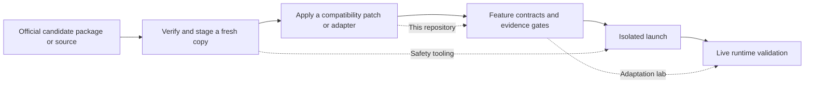

# codex-history-compat

## v0.2.2: Desktop 26.924.2738.0 profile

The `desktop-26.924.2738.0-sqlite-v2` profile targets Codex `0.158.0-alpha.2.1` at upstream commit `0d9c7cbfa6cf1489f55a8a9542b75ddd2c061807`. The existing `0.158.0-alpha.2` profile for Desktop `26.924.1866.0` and the legacy apply entry points remain available. See [Compatibility](COMPATIBILITY.md) for profile selection.

On Windows, use Python 3.11+, Git, Rust 1.95.0 and the x64 MSVC developer environment with Windows SDK. Run the build from a Git checkout of this repository so its exact commit is recorded in the manifest. The build writes to a new target directory and runs the compatibility tests before compiling the launcher-consumed `codex` binary:

```powershell
py -3 build_backend.py --profile desktop-26.924.2738.0-sqlite-v2 --target C:\codex-compat\backend --official-backend C:\official\app\resources\codex.exe
```

You can supply `--source` with a local upstream Git repository; its exact pinned commit is still checked. The repository contains no compiled backend. The local result includes `codex.exe`, `manifest.json`, a source checkout and build logs. Inspect local reports before sharing them.

To apply the new profile without building:

```powershell
.\apply.ps1 -CodexRoot .\codex -Profile desktop-26.924.2738.0-sqlite-v2
```

On Unix, use `./apply.sh /path/to/codex desktop-26.924.2738.0-sqlite-v2`. Omitting the profile retains the original upstream revision.

The current profile keeps tool-item metadata, normalizes only outbound history, and covers ordinary requests, WebSocket requests, local compaction and remote compaction V2. Remote compaction V1 no longer exists in this upstream version. Source-built Windows backends preserve the official migration-file bytes and verify their embedded checksums; they do not rewrite existing migration records.

Desktop integration is provided by `codex-desktop-workflow` as an explicit `compat` backend mode.


While maintaining a ChatGPT/Codex desktop mod, I need both to follow official desktop updates and to keep different tasks on their established model services. A Responses-compatible service can reject history because of reasoning items, tool-call ordering, or image-resize notices. Fixing an ordinary request once does not prove that WebSocket or compacted history will still work.

This patch normalizes only the copy about to be sent and leaves durable local history alone. It is the compatibility part of the maintenance workflow: [electron-update-safety](https://github.com/catterhu1207-ux/electron-update-safety) handles safe isolation of a candidate package, while [desktop-adaptation-lab](https://github.com/catterhu1207-ux/desktop-adaptation-lab) explains the task workflow and acceptance states.

## What can I use it for?

- Add outbound-history compatibility handling to the pinned Codex source revision when using a Responses-compatible service.
- Handle encrypted reasoning items, orphaned tool calls or outputs, and image-resize notices placed between a call and its output without rewriting durable history.
- Apply the same rule to ordinary requests, WebSocket requests, local compaction, and the remote compaction paths available in each profile.
- Reproduce the structure failure with synthetic fixtures only; no authentic request, session, image, or user path is included.

It is for people who build Codex from source and maintain a custom provider connection. It is not for ordinary users of the official desktop application.

To generate the desktop workflow mod from your own official Codex installation first, use [codex-desktop-workflow](https://github.com/catterhu1207-ux/codex-desktop-workflow). Desktop v0.3.1 pins separate compatibility profiles for 26.924.2738.0 and 26.924.1866.0; earlier desktop profiles remain official-backend only.

## Which of the four repositories do I need?

| Problem | Repository |
|---|---|
| Generate and run the mod from my own official Codex installation | [codex-desktop-workflow](https://github.com/catterhu1207-ux/codex-desktop-workflow) |
| A Codex history request is rejected by a compatible provider | **codex-history-compat** (this repository) |
| Is the update candidate trustworthy, and did isolated testing leave a process behind? | [electron-update-safety](https://github.com/catterhu1207-ux/electron-update-safety) |
| How do I require matching evidence before an adaptation moves forward? | [desktop-adaptation-lab](https://github.com/catterhu1207-ux/desktop-adaptation-lab) |


```mermaid
flowchart LR
  A[Official candidate package or source] --> B[Verify and stage a fresh copy]
  B --> C[Apply a compatibility patch or adapter]
  C --> D[Feature contracts and evidence gates]
  D --> E[Isolated launch]
  E --> F[Live runtime validation]
  B -.Safety tooling.-> E
  C -.This repository.-> D
  D -.Adaptation lab.-> F
```

## What changes, and what does not?

| Target | Behavior |
|---|---|
| Request copy about to be sent to the model service | Removes incompatible reasoning items, moves messages out of interrupted tool-output regions, and repairs required tool-call pairing |
| Durable history and local session | Not rewritten |
| Ordinary, WebSocket, local-compaction, and remote-compaction requests | Uses the same compatibility pass |

The patch changes provider-incompatible shapes only for a target provider other than OpenAI. It does not promise that every third-party service will work or configure a service URL, account, or model for you.

## Quick path

The patch is strictly pinned to upstream commit `b5bffd3ec4db487e7e3dec59663875b0ef7b72ca`. Start with a clean source tree; the scripts reject a different commit or a dirty tree.

```powershell
git clone https://github.com/openai/codex.git
git -C codex checkout b5bffd3ec4db487e7e3dec59663875b0ef7b72ca
.\apply.ps1 -CodexRoot .\codex
cargo test --manifest-path .\codex\codex-rs\Cargo.toml -p codex-core prompt_history_compat --lib -- --test-threads 1
```

On Linux or macOS, run `./apply.sh /path/to/codex`. The scripts copy the compatibility module and synthetic fixture, then apply the minimal integration diff across five request paths.

## What it does not do

- It does not ship Codex binaries, an official desktop package, a complete frontend patch, or an automatic updater.
- It does not replace compatibility testing against a third-party service; default CI never calls a live remote service.
- It does not resolve conflicts for later upstream revisions. Recompare the patch and run the tests after every upgrade.

The repository retains the applicable Apache-2.0 `LICENSE` and `NOTICE` and contains synthetic fixtures only. 中文说明见 [README.md](README.md).

The sqlite-v2 profile checks all 72 migrations across state, logs, goals, memories, queue and thread history. Cached binaries missing any checksum trigger state-crate recompilation. Existing profiles retain their original identities.
