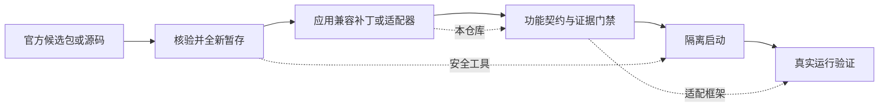

# codex-history-compat

我维护 ChatGPT/Codex 魔改版时，既要跟上官方桌面版更新，也要让不同任务继续使用原来的模型服务。问题是，历史请求到了 Responses 兼容服务后，可能因为推理项、工具调用顺序或图片缩放提示被拒绝。一次临时修好普通请求，也不代表 WebSocket 或压缩后的历史还能工作。

这个补丁把“将要发出的副本”整理成兼容服务更容易接受的结构，同时不改写本地历史。它是整套维护流程中的兼容环节：候选包的隔离安全由 [electron-update-safety](https://github.com/catterhu1207-ux/electron-update-safety) 处理，任务工作流与验收状态由 [desktop-adaptation-lab](https://github.com/catterhu1207-ux/desktop-adaptation-lab) 说明。

## 我可以拿它做什么？

- 为绑定的 Codex 源码提交增加一层出站历史兼容处理，以对接 Responses 兼容服务。
- 在不改写持久历史的前提下，处理第三方服务常拒绝的加密推理项、孤立工具调用/输出，以及夹在调用与输出之间的图片缩放提示。
- 让普通请求、WebSocket、本地压缩和两条远程压缩路径使用同一套规则，减少“平时可用、压缩后失败”的差异。
- 用合成回归样例复现结构问题，不公开真实请求、会话、图片或用户路径。

适合愿意自行编译 Codex、维护自定义模型服务连接的人。如果你只想使用官方桌面应用，或无法接受源码补丁与构建流程，本仓库不适合你。

## 三个仓库怎么选？

| 你要解决的问题 | 使用这个仓库 |
|---|---|
| Codex 发出的历史请求被兼容服务拒绝 | **codex-history-compat**（本仓库） |
| 更新候选包是否可信，隔离运行是否有后台残留 | [electron-update-safety](https://github.com/catterhu1207-ux/electron-update-safety) |
| 如何让适配阶段必须具备对应证据才能继续 | [desktop-adaptation-lab](https://github.com/catterhu1207-ux/desktop-adaptation-lab) |



## 它改变什么，不改变什么？

| 处理的对象 | 行为 |
|---|---|
| 即将发送给模型服务的请求副本 | 过滤不兼容推理项，重排被消息打断的工具输出，并补齐必要的工具调用配对 |
| 持久历史与本地会话 | 不改写 |
| 普通、WebSocket、本地压缩、远程压缩请求 | 接入同一兼容处理 |

补丁只在目标提供方不是 OpenAI 时调整不兼容形状；它不承诺任何第三方服务一定可用，也不会替你配置服务地址、账号或模型。

## 最短使用路径

该补丁严格绑定上游提交 `b5bffd3ec4db487e7e3dec59663875b0ef7b72ca`。脚本会拒绝错误提交和非干净工作树，先为干净源码副本操作。

```powershell
git clone https://github.com/openai/codex.git
git -C codex checkout b5bffd3ec4db487e7e3dec59663875b0ef7b72ca
.\apply.ps1 -CodexRoot .\codex
cargo test --manifest-path .\codex\codex-rs\Cargo.toml -p codex-core prompt_history_compat --lib -- --test-threads 1
```

Linux/macOS 可使用 `./apply.sh /path/to/codex`。应用脚本会复制兼容模块和合成样例，再应用五个现有请求路径的最小差异。

## 它不能替你做什么？

- 不提供 Codex 二进制、官方桌面包、完整前端补丁或自动更新。
- 不替代第三方模型服务的协议兼容性测试；默认 CI 不调用真实远程服务。
- 不处理上游提交之外的版本冲突；升级后应重新比较补丁并运行测试。

仓库保留适用的 Apache-2.0 `LICENSE` 和 `NOTICE`，并且只包含合成样例。英文说明见 [README.en.md](README.en.md)。
